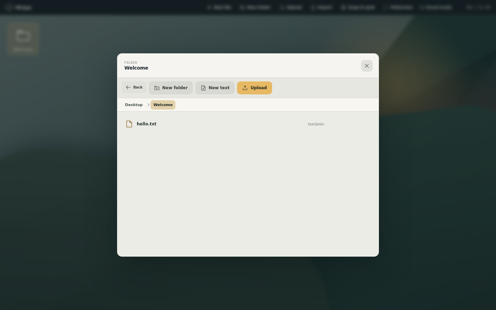
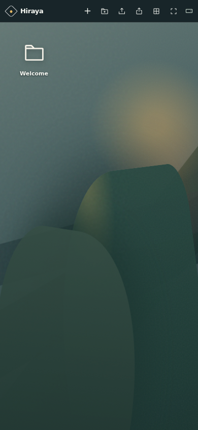

# Hiraya

Hiraya is a synchronized mock desktop. A Go server stores the authoritative shared workspace, while each browser keeps a local cache in the Origin Private File System (OPFS).

[Open Hiraya on GitHub Pages](https://nmcapule.github.io/hiraya/)

<p align="center">
  
  
</p>

## Development

Install dependencies, then run the backend and Vite in separate terminals:

```sh
bun install
bun run server
bun run dev
```

Vite proxies `/api` to `http://127.0.0.1:8080`. The server stores its data in `.hiraya-data` by default. Browser mutations are committed to a durable local queue while disconnected and replay automatically when the server returns.

The authoritative file tree is stored under `.hiraya-data/files` using the same names and folder hierarchy shown in Hiraya. Empty Hiraya folders are real directories. Stable internal IDs and revisions live in the WAL-enabled `.hiraya-data/workspace.sqlite` database, while the HTTP workspace schema remains version 4. Existing `workspace.json` metadata is validated and imported automatically on first startup. Legacy ID-named blobs are also verified and migrated automatically to the logical tree.

Files and folders may also be changed directly in the server's `files` directory. Hiraya watches the tree and performs a fallback scan every second; it also scans at startup for changes made while the server was stopped. Same-path file edits preserve their ID, while external renames and moves are represented as a deletion and a newly created entry. Symbolic links, non-regular files, invalid names, and case-insensitive sibling conflicts are ignored and logged. Avoid placing unrelated files in this directory.

Desktop workspace tiles are derived views, not persisted containers. Each root entry stores signed, finite `x` and `y` coordinates on one continuous logical surface. A browser divides that surface into tiles using only its current viewport and those coordinates, so resizing can change the visible tile arrangement without rewriting saved positions. Dragging an icon through an outer edge previews a transient destination tile; only a successful drop persists the icon's resulting coordinates. Rearranging tiles in the minimap translates the coordinates of the affected root entries as one atomic batch, preserving their local positions within each tile.

The backend accepts these optional environment variables:

- `HIRAYA_ADDR`: listen address, default `127.0.0.1:8080`.
- `HIRAYA_DATA_DIR`: durable metadata and file directory, default `.hiraya-data`.
- `HIRAYA_STATIC_DIR`: production frontend directory, default `dist`.
- `HIRAYA_MAX_UPLOAD_BYTES`: maximum bytes in one upload or bootstrap, default 100 MiB.
- `HIRAYA_TLS_CERT_FILE` and `HIRAYA_TLS_KEY_FILE`: optional PEM certificate and private key paths. Set both to serve HTTPS directly; omit both to serve HTTP.

Build and run the same-origin production server with:

```sh
bun run build
go build -o hiraya-server ./cmd/hiraya-server
./hiraya-server
```

This initial server exposes one shared workspace without authentication. Keep it bound to a trusted interface; anyone who can reach it can read or change the workspace.

### Docker

Build the production image and run it with a named volume for the authoritative workspace:

```sh
docker build -t hiraya .
docker run -d \
  --name hiraya \
  --restart unless-stopped \
  -p 8080:8080 \
  -v hiraya-data:/data \
  hiraya
```

The container serves both the frontend and API on port `8080`, reports its status at `/api/health`, and runs as an unprivileged user. Keep `/data` on an explicitly managed volume so the authoritative workspace survives container replacement. `HIRAYA_MAX_UPLOAD_BYTES` can be passed with `docker run -e` to override the 100 MiB default.

HTTP is the default and is suitable for `localhost`. To serve trusted HTTPS directly on port `8080`, mount a certificate covering the hostname and its private key:

```sh
docker run -d \
  --name hiraya \
  --restart unless-stopped \
  -p 8080:8080 \
  -v hiraya-data:/data \
  -v /path/to/fullchain.pem:/tls/fullchain.pem:ro \
  -v /path/to/privkey.pem:/tls/privkey.pem:ro \
  -e HIRAYA_TLS_CERT_FILE=/tls/fullchain.pem \
  -e HIRAYA_TLS_KEY_FILE=/tls/privkey.pem \
  hiraya
```

Remote browsers require this HTTPS mode or an HTTPS reverse proxy because OPFS is unavailable on insecure non-localhost origins. The certificate must be trusted by every client device, and both mounted PEM files must be readable by the container's unprivileged UID 100.

To bundle a seeded desktop into the frontend, pass its repository-relative directory at image build time:

```sh
docker build \
  --build-arg HIRAYA_SEEDED_DIR=examples/seeded \
  -t hiraya:seeded .
```

Put the container behind an HTTPS reverse proxy for production PWA installation and offline caching. The server has no authentication, so do not expose it to untrusted networks without adding access controls at the proxy or application layer.

## Synchronization

The server orders accepted writes with a monotonic revision. The last accepted write to an entry wins, while writes to different entries are retained independently. Layout and editor settings have their own revisions. Server-Sent Events notify connected browsers of changes; browsers then fetch current metadata and only download file bodies whose content revision changed.

The browser cache uses a WAL-enabled SQLite database in OPFS. A SharedWorker coordinates tabs through one dedicated SQLite connection and transfers ownership when its host tab closes. It stores entries, coordinates, layout, editor settings, synchronization revisions, and a durable mutation outbox; workspace tiles themselves are not stored. Existing `.hiraya-manifest.json` versions 1 through 12 are validated and imported once.

If the server has never been initialized, the first browser uploads its complete saved OPFS desktop. If the server is already initialized, its workspace replaces a first-time browser's local desktop. Metadata is committed only after referenced file contents are durable. Direct filesystem changes join the same monotonic revision stream and propagate to connected browsers through SSE.

## Install and offline use

Hiraya is an installable progressive web app. In a supported browser, use the browser's **Install app** action to add it to the desktop or home screen. The installed app launches in a standalone window; open **Settings** and use **Fullscreen** to enter or leave native fullscreen mode where the Fullscreen API is available.

The production service worker caches Hiraya's app shell, SQLite worker, and WASM runtime, so the installed app can reopen offline after it has loaded successfully once. Hashed frontend resources use long-lived browser caching when served by the Go process. Open **Settings** to check for a new frontend version or change automatic update checks; a detected update waits for confirmation before reloading. Offline changes update the local desktop immediately and replay in order after reconnecting. A structural conflict is retained as a blocked operation and shown by the sync indicator instead of being silently discarded. The cache and queue are tied to the exact browser origin and are not a backup: clearing site data removes them, and using a different hostname or port creates a separate local cache.

Installation and offline caching require HTTPS in production. Browsers treat `localhost` as secure for development.

## Seeded desktop

Set `HIRAYA_SEEDED_DIR` at development or build time to bundle a seeded desktop:

```sh
HIRAYA_SEEDED_DIR=examples/seeded bun run dev
HIRAYA_SEEDED_DIR=examples/seeded bun run build
```

The value must be a directory inside the repository. It must contain a `manifest.json`; each file entry's `contentUrl` is resolved relative to that directory. See `examples/seeded` for the version 7 format. Version 1 through 6 packages remain accepted and are normalized to the current format. Older packages default to the Hiraya Dusk theme and Dusk wallpaper, and version 1 also defaults to snap-to-grid being disabled.

The seeded desktop is copied into OPFS only when the browser origin has neither a Hiraya SQLite database nor a legacy manifest. Existing desktops, including intentionally empty desktops, are never merged with or replaced. After seeding, seeded files and folders behave like ordinary editable entries. If the shared server is also uninitialized, this seeded desktop becomes its initial workspace; an initialized server remains authoritative. Clearing the origin's site data removes the local cache and allows seeded content to seed it again before synchronization.

The build rejects malformed manifests, missing or size-mismatched content, paths outside the configured directory, and symbolic links.

### Frontend-only deployment

Set `HIRAYA_FRONTEND_ONLY=true` to run without the Go sync server. In this mode, each browser's OPFS desktop is authoritative, editing remains enabled, and no `/api` requests are made. Changes are private to that browser and persist across reloads. Set `HIRAYA_BASE_PATH` when hosting Hiraya below an origin root:

```sh
HIRAYA_FRONTEND_ONLY=true \
HIRAYA_SEEDED_DIR=examples/seeded \
HIRAYA_BASE_PATH=/hiraya/ \
bun run build
```

Pushes to `main` deploy this frontend-only build to GitHub Pages using `examples/seeded`. Returning browsers retain their locally edited desktop when a new version deploys; updated seeded content seeds only browsers without an existing Hiraya manifest.

## Themes

Open **Settings → Appearance** to choose Hiraya Dusk, Warm Paper, Midnight Glass, or High Contrast. Themes are separate from wallpapers and change the application palette, window shape and effects, typography, density, motion, desktop icon sizing, and editor syntax colors.

Built-in themes are immutable. Use **Duplicate / edit** to preview changes live, then save a named custom theme. The selected theme and custom-theme library are shared workspace resources: they synchronize between connected clients, queue while offline, persist across server restarts, and are included in seeded exports. The operating system's reduced-motion preference always overrides a theme's motion setting.

## Export

Open **Settings** and use **Export desktop** to download `hiraya-seeded.zip`. The archive contains `hiraya-seeded/manifest.json` and its `content` tree. Extract that directory into the repository and pass it to `HIRAYA_SEEDED_DIR` to seed the exported desktop in a fresh browser origin.

Export includes all saved files, folders, signed finite icon coordinates, layout, shared wallpaper, snap-to-grid preference, editor settings, the selected theme ID, and custom theme definitions from the synchronized OPFS cache. Built-in theme definitions and unsaved editor changes are not included.
