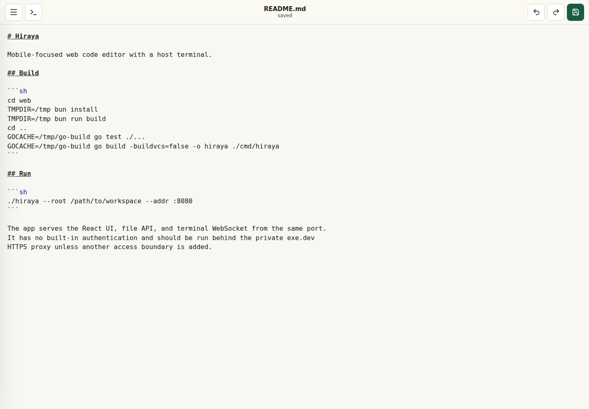
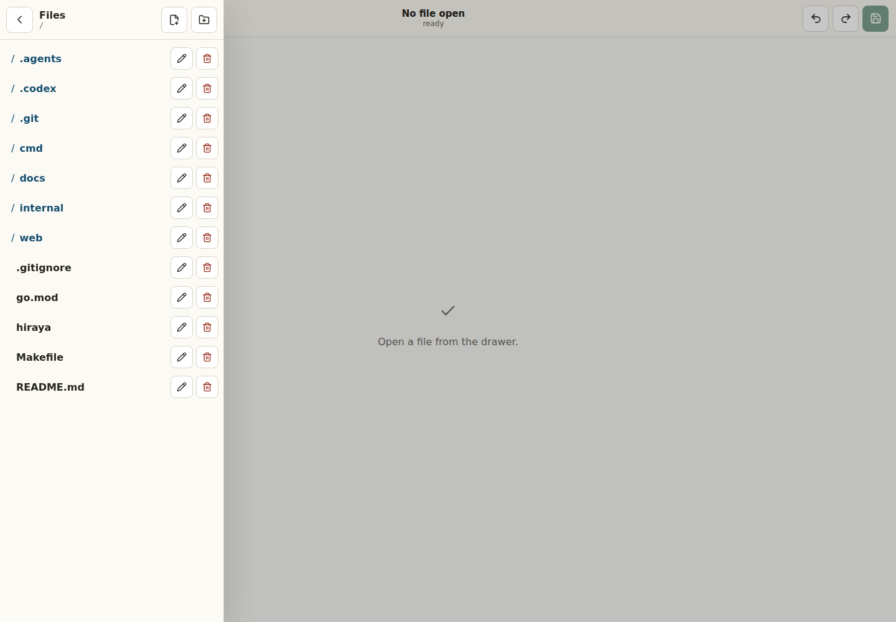
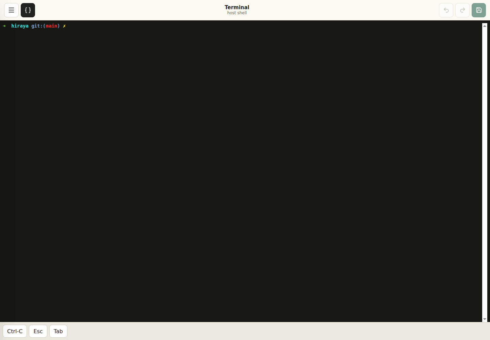
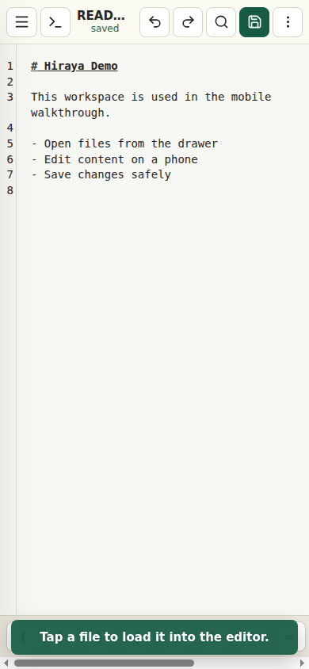

# Hiraya

Hiraya is a mobile-focused web code editor for working on a server-side
workspace from a browser. It serves a file browser, CodeMirror editor, file API,
and host terminal from one Go process so a small development environment can be
reached from a phone, tablet, or desktop browser.

It is intended for private, remote development sessions where the app is exposed
through a trusted access boundary such as the exe.dev HTTPS proxy. Hiraya does
not include built-in authentication.

## Features

- Browse, create, rename, delete, edit, and save files under a configured root.
- Open a host shell in the browser through a terminal WebSocket.
- Use mobile-friendly controls for common editor and terminal actions.
- Build a production binary with embedded frontend assets.

## Screenshots







## Video Walkthrough

[](docs/videos/hiraya-mobile-walkthrough.mp4)

[Watch the mobile walkthrough](docs/videos/hiraya-mobile-walkthrough.mp4)

## Requirements

- Go
- Bun and Make for local frontend development or production builds

## Build

```sh
make prod
```

`make prod` installs frontend dependencies, builds the React app, runs Go tests,
and writes the production binary to `./hiraya`.

For a faster local binary build without rebuilding production frontend assets:

```sh
make build-dev
```

## Run

### Direct from GitHub

Run Hiraya directly with Go:

```sh
go run github.com/nmcapule/hiraya/cmd/hiraya@latest --root /path/to/workspace --addr :8080
```

Use a tagged version for a reproducible run:

```sh
go run github.com/nmcapule/hiraya/cmd/hiraya@v0.1.0 --root /path/to/workspace --addr :8080
```

### Local Development

```sh
ROOT=/path/to/workspace ADDR=:8080 make dev
```

`make dev` runs the Go backend and Vite dev server together. `ROOT` controls the
workspace served by the app, and `ADDR` controls the backend listen address.

After a production build, run the compiled binary directly:

```sh
./hiraya --root /path/to/workspace --addr :8080
```

The app serves the production React UI, file API, and terminal WebSocket from the
same port.

Hiraya is also installable as a PWA from supported browsers when served from a
secure origin, such as localhost during development or the exe.dev HTTPS proxy.
Open the app in the browser and use the browser's install action to add it to
the home screen or app launcher.

## Usage Guide

1. Start Hiraya with `ROOT` pointed at the workspace you want to edit.
2. Open the app in your browser.
3. Use the menu button to open the file drawer.
4. Select a file to load it into the editor.
5. Edit the file and use the save button to write changes back to disk.
6. Use the terminal button to switch between the editor and host shell.
7. Use the drawer action buttons to create files or folders, rename paths, or
   delete paths inside the configured workspace root.

The terminal runs on the host where Hiraya is started, with the same workspace
root. Treat it like direct shell access to that machine.

## Make Targets

```sh
make help       # Show available targets and variables
make prod       # Build production frontend assets, test, and build ./hiraya
make build-dev  # Install frontend deps and build the Go binary
make dev        # Run the backend and Vite dev server
make test       # Run Go tests
make clean      # Remove the binary and built frontend assets
```

Common variables:

```sh
ROOT=/path/to/workspace  # Workspace root served by the app
ADDR=:8080               # Backend listen address
TMPDIR=/tmp              # Temporary directory used by Bun
GOCACHE=/tmp/go-build    # Go build cache directory
```

## Security

Hiraya has no built-in authentication. Do not expose it directly to the public
internet. Run it behind the private exe.dev HTTPS proxy or another trusted access
boundary.
